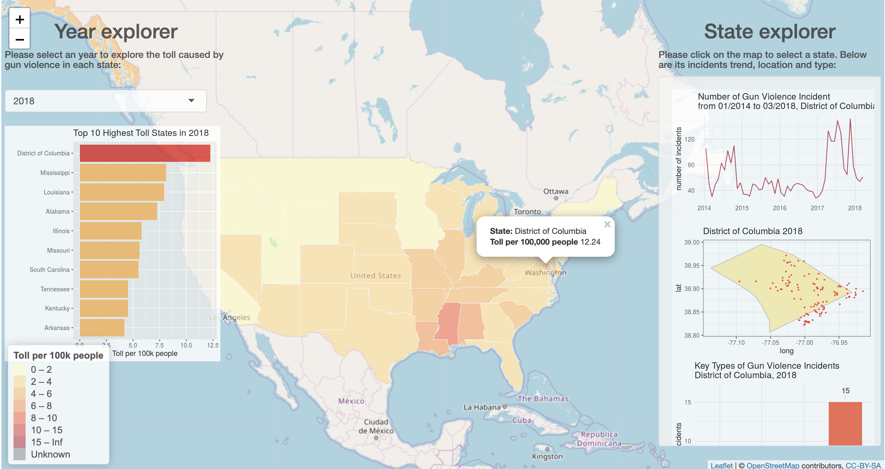

# Interactive component

We do the interactive part in Shiny, you could open shiny through this [link](https://jessie-xj.shinyapps.io/5702_final_project/). The UI is shown like:

The shiny app shows the toll damage caused by the gun violence incidents of each state in each year. On the left panel the 10 states with highest toll rate are shown. Click the state of interest in the map, the right panel would show the information of the corresponding incidents causing the damage.
